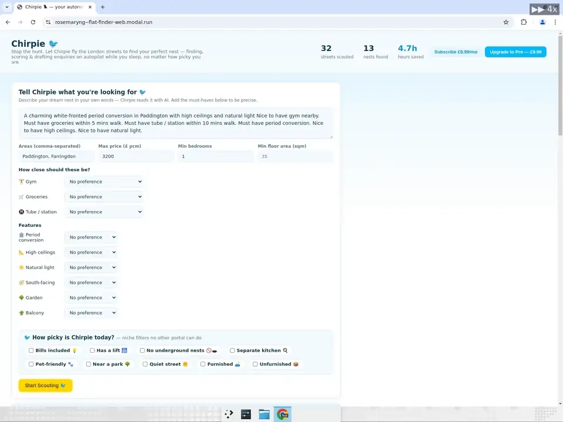

# Chirpie 🐦 — your autonomous London nest-finder

> **Stop the hunt. Let Chirpie fly the London streets to find your perfect nest.**
> The only rental agent that flies tirelessly while you sleep — finding, scoring, and
> drafting enquiries for your perfect London flat on autopilot, no matter how picky you are.

Built for the **Cursor "Hands Off" Hackathon**: a self-running agent that does the
flat-hunting work for you.

## See it in action 🎬
**Live app:** you can view it at **https://rosemaryng--flat-finder-web.modal.run/**



*A renter types their own brief, sets a minimum floor area, and taps Chirpie's Picky
Filters (has a lift, no underground nests, pet-friendly, near a park). Start Scouting
sends Chirpie flying over London — real Rightmove nests rank back with scores,
bird-voice reasons, and a ready-to-send enquiry draft.*

## How it works
1. **You tell Chirpie what you want** in plain English (e.g. "a bright period
   conversion in Paddington or Farringdon, over 35 sqm, under 10 min walk to the Tube").
2. **Chirpie searches every hour**, scanning London listings for you automatically.
3. **It checks the things you'd never have time to** — energy rating (EPC), walk to
   the Tube, nearby supermarkets and gyms, floor area, and which way the windows face.
4. **It scores every flat against your wishlist** and keeps only the real matches,
   each with a short reason why ("Chirpie loves this one! Just a hop, skip & a jump
   from the Tube").
5. **It drafts the enquiry email for you** so you can register interest in one click.
6. **You just check the dashboard.** New nests appear on their own — no more scrolling.

```
your brief  ─▶  search  ─▶  check the details  ─▶  score & rank  ─▶  draft email  ─▶  dashboard
(plain text)    every hour   EPC · Tube · shops      keep real          ready to            new nests
                             gyms · size · light     matches only       send                appear on their own
```

## What makes Chirpie special ✨
- **Personalised, niche filters ✨.** Normal property sites only let you filter by price,
  beds and area. Chirpie understands the picky stuff they *can't* search. Just say it in
  plain words, for example:
  - 🏋️ "must have a gym within 5 mins walk"
  - 🛒 "must have groceries within 5 mins walk"
  - 🚇 "quick hop to the Tube — under 10 mins walk"
  - ☀️ "south-facing with lots of natural light"
  - 🏛️ "a charming white-fronted period conversion with high ceilings"
  - 📏 "bigger than 35 sqm" · ⚡ "EPC C or better" · 🌳 "near a park"
- **🤖 LLM-powered matching.** Chirpie uses an LLM to *understand* your wishlist (not just
  keyword-match it) and to read each listing for you — enriching with data humans never
  check (EPC, floor area, commute, nearby gyms & shops) — so it finds your perfect match
  and a missing detail never slips a bad flat in.

## Business model
- **Subscription:** Chirpie searches for new flats **every hour** and surfaces fresh
  matches the moment they hit the market — pay monthly to keep your agent flying.
- **Done-for-you enquiries:** Chirpie **drafts the enquiry email for each match**, so you
  can reach the agent first, faster than anyone scrolling listings by hand.

## Quickstart (zero keys, runs offline)
The core pipeline ships with deterministic fallbacks, so it runs with no API keys.

```bash
pip install -r requirements.txt
python run_local.py          # pulls real London listings, scores a demo brief
python -m web.app            # dashboard at http://localhost:5000
```

If you have `make`, the fastest path is `make setup && make web`, then open
http://localhost:5000. See **[docs/LOCAL_DEV.md](docs/LOCAL_DEV.md)** for copy-paste
steps (macOS, Linux, Windows PowerShell) and troubleshooting.

## Add real intelligence (optional keys)
Drop these into `.env` (see `.env.example`) and the matching upgrades turn on automatically:

| Key | Unlocks |
|---|---|
| `OPENAI_API_KEY` | LLM brief-parsing, **floorplan vision** (sqm/aspect), nuanced scoring, human-quality enquiry drafts |
| `SUPABASE_URL` / `SUPABASE_SERVICE_KEY` | Shared Postgres store (schema in [`supabase_schema.sql`](supabase_schema.sql)). Auto-selected when set. |
| `FLATFINDER_STORE` | Force a store backend: `supabase` \| `modal` (named `modal.Dict`) \| `local`. Default auto-picks Supabase → modal.Dict → local JSON. |
| `PAYPAL_CLIENT_ID` / `PAYPAL_SECRET` | Real (sandbox) checkout; else payments are simulated |
| `EPC_API_KEY` | Official gov EPC rating + floor area by postcode |
| `TFL_APP_KEY` | Higher TfL rate limits |

## Deploy hands-off (Modal)
```bash
pip install modal && modal token new
modal secret create flatfinder-secrets OPENAI_API_KEY=... \
    PAYPAL_CLIENT_ID=... PAYPAL_SECRET=...
modal deploy app_modal.py     # the hourly search now runs unattended
```
- `scan` — the hourly search (collect → enrich → match → draft)
- `submit` — on-demand register-interest / viewing request for one match
- `web` — the dashboard as a Modal web endpoint

## Layout
```
flatfinder/
  collectors/   rightmove.py, onthemarket.py  (+ base parser)
  enrich/       epc.py, floorplan.py (vision), geo.py (commute + POIs)
  brief.py      free-text  -> structured Brief (LLM or heuristic)
  scoring.py    listing × brief -> score + bird-voice reasons (LLM or rules)
  enquiry.py    draft (+ optional Playwright submit, off by default)
  store.py      shared modal.Dict / Supabase / local-JSON store (same interface)
  pipeline.py   the hands-off loop
payments/paypal.py     sandbox checkout + capture
web/app.py             Flask dashboard (Chirpie UI)
app_modal.py           Modal deployment
```

## Important caveats (read before going to production)
- **Portal ToS / scraping.** Rightmove & Zoopla forbid scraping and block bots. The
  collectors here are for the **demo** — for a real product, switch the data layer to
  **parsing the portals' own email alerts** or a licensed feed. The store/collector
  split makes this swap easy.
- **Auto-submitting enquiries** can breach ToS and annoy agents. It is **disabled by
  default** (`ALLOW_AUTO_SUBMIT`); the intended UX is "Chirpie drafts → you approve → send".
- **"Window facing" / orientation** is often a best-effort estimate (from the floorplan's
  compass arrow), not ground truth.

## License
MIT — hackathon prototype, not investment or housing advice.
</content>
